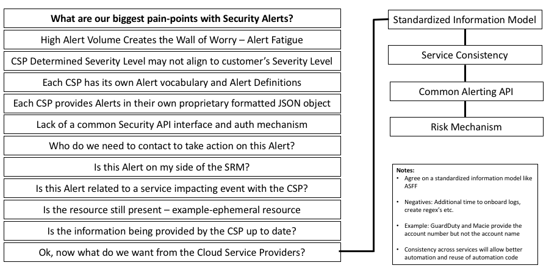
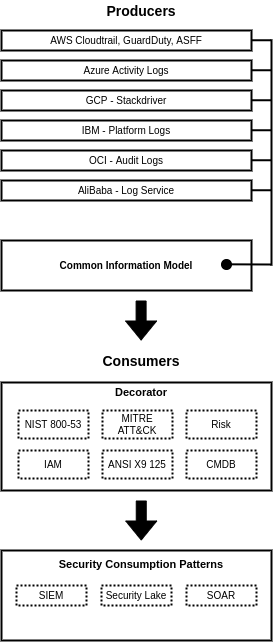

# 1. CSNF Decorator - README

## 1.1 Cloud Security Notification Framework (CSNF) Decorator

**Objectives and Goals:** These learnings aggregated requirements and culminated into a construct and context for the CSNF “decorator.” Below is an abbreviated list of objectives and goals.

A CSNF architecture and consumption model has been developed with the objective to communicate architectural components of the framework along with today’s friction, the goal of a common information model, the role of the open decorator and decorated alert consumption. 

**What is the Purpose of the CSNF Decorator?:** In object-oriented programming, the decorator pattern is a design principle that allows behavior to be added to an object without defining an entirely new object. The CSNF decorator provides the CC with a mechanism to “decorate” or enrich security events by augmenting the original security event with additional contextual information to improve fidelity and increase the ability of security teams to identify security events that are most important to them.

A “decorator” has been defined to democratize CSP security notifications

1. Requirements have been documented (see figure below)
2. Security events have been prioritized (Collaborative repo is [here](https://drive.google.com/drive/folders/1qh7l2CVcZQKKCack8smrFZd1l_Ft00yy?usp=sharing))

The “decorator” is to provide a common set of definitions and syntax to:

1. Ease ingestion of CSP security notifications into security data lakes and other security plus observability tools
2. Provide CSPs translational services to understand common security notifications between and across CSPs Mappings of NIST controls and Mitre ATT&CK into a decorator are high priority to deliver cross CSP translational service
3. Extended log information field attributes are to be accommodated to better understand context, e.g., each CSP to provide a log plus type set of meta field

**Desired Outcome**: The CSNF decorator outcome will provide the ability to interpret or interrogate security events/alerts/alarms, etc., across various CSP logs using common standards such as NIST, Mitre ATT&CK, etc. An operator or system may consume CSP logs through the lens of these standards which deliver the same consistent answer/output independent of CSP source. In addition, a collection of additional vetted meta fields that include additional content, which can be vetted along with the log such as an alert with a resource ID, display name, etc. The CC could curate a collection of content that it may want vetted to assist it in building its controls. These attributes become highly beneficial to prioritize incident response as well as reduce the amount of times a CC may need to query a CSP(s) to collect needed data.  

**Next Steps**: With the CC providing aggregate requirements, the next step is to move into a building phase where the CSPs offer a proposal to collaborate and develop the decorator as suggested during a previous working group session. This will provide a focus and the organizing principle for the CC to further aggregate requirements into the decorator. CSPs will develop a plan and prototype to be presented during the Tuesday check-in meetings where CCs can provide input and guidance on progress to assure the decorator is well received by the community and industry at large. As a goal, a minimum (slice of functionality) demonstration of the decorator operating within an end-to-end solution to showcase its value and promise is to be presented at ONUG Spring on May 5th and 6th with a more robust demonstration at ONUG Fall on October 20th and 21st.  CCs will test via Proof of Concept the decorator within their security data lakes, providing additional engineering input to CSPs and be publicly communicate findings via the ONUG collaborative.  For committed companies and further information on the ONUG collaborative please go [here](https://onug.net/collaborative/).  

## 1.2. Multi-Cloud Security Pain Points

As more organizations are shifting infrastructure and services to the cloud, more are adopting a multi-cloud strategy.

But for all the benefits of a multi-cloud strategy, there are some challenges that come with it as well. As the volume of information increases so does the noise and alert fatigue begins to set in. Cloud customers need a new way to address the ever increasing volume of security events in an attempt to bring order to the chaos. 

## 1.3. Multi-Cloud Security Events and the need for a Common Information Model

**Today:** CSP's all provide semantically equivalent elements but elbow grease is required to get them into a common format suitable for downstream processing

**Common Information Model:** We are asking CSP's to provide alerts using an open and common set of elements that eliminate ambiguity and allow frictionless processing of security alerts at scale for their customers

**Decorator:** Alerts received through batch or stream processing are then decorated or 'enriched' providing additional context that speeds decision making, streamlines automation and allows security teams to operate at scale

**Decorated Alert Consumption:** Decorated alerts are received and processed by the Cloud customer to answer questions and report on trends that are most important to them. Deep insights can be applied to identify anomalous activity, find indicators of compromise, or update risk scores across all CSP workloads

**What Is the Purpose of the CSNF Decorator?** In object-oriented programming, the **decorator pattern** is a design principle that allows behavior to be added to an object without defining an entirely new object. The CSNF decorator provides the CC with a mechanism to “decorate” or enrich security events by augmenting the original security event with additional contextual information to improve fidelity and increase the ability of security teams to identify and respond to security events.

**A “decorator” has been defined to democratize CSP security notifications**

1. Requirements have been documented (see figure below)
2. Security events have been prioritized (Collaborative repo is [here](https://drive.google.com/drive/folders/1qh7l2CVcZQKKCack8smrFZd1l_Ft00yy?usp=sharing))

**The  “decorator” is to provide a common set of definitions and syntax to:**

1. Ease ingestion of CSP security notifications into security data lakes and other security plus observability tools
2. Provide CSP's translational services to understand common security notifications between and across CSPs  
3. Mappings of NIST controls and MITRE ATT&CK into a decorator are high priority to deliver cross CSP translational service
4. Extended log information field attributes are to be accommodated to better understand context, e.g., each CSP to provide a log plus type set of meta field

## 1.4. How CSNF Benefits the Entire Security Operational Ecosystem:

Security platforms often require expensive and time-consuming integration efforts to bring in log files from disparate sources such as security alerts, asset inventory, vulnerability assessment, endpoint agents, and IDS products. A common standard like CSNF provides enriched security events that can simplify integration efforts and improve contextual processing by your SIEM, SOAR or data lake platforms.  

The CSNF decorators can be used to filter SIEM detection rules based on asset value, compliance type (PCI, PHI) or MITRE ATT&CK framework TTP’s. Contextual filtering can reduce time to threat detection, and thus, help teams focus on the most relevant information during a security investigation and more efficiently prioritize incident response.

SOAR platform workflows can be enhanced by receiving CSNF-decorated security alerts that have been augmented based on the MITRE ATT&CK framework. The event and alert management capabilities of the SOAR are then able to quickly prioritize inbound security events and trigger automated security responsive actions or workflows.

The same CSNF decorator benefits apply to security data lakes. A security data lake is different from the typical SIEM model in terms of architecture and search orientation. A security data lake implies a cloud-hosted solution that brings in data from multiple sources and leverages cost-effective cloud storage. Security teams often don’t know in advance what data to collect but all the data is stored in the cloud data lake. This allows organizations to move beyond search capabilities of the SIEM to true data analytics. The elastic capabilities of cloud allow the security team to focus in improving security posture rather than managing on-premise compute and storage. CSNF enrichments will enhance the ability of security teams to perform analytics that extend beyond threat-hunting to allow advanced analytics and anomaly detection that can be used to define new security policy as code or identify risky applications. Machine learning and anomaly detection using security data lakes will allow security or development teams advance warning so that actions can be taken prior before a security event or incident occurs.

In addition, a collection of additional vetted meta fields that include additional content, which can be vetted along with the log such as an alert with a resource ID, display name, etc. The CC could curate a collection of content that it may want vetted to assist it in building its controls. These attributes become highly beneficial to prioritize incident response as well as reduce the amount of times a CC may need to query a CSP(s) to collect needed data.  

## Next Steps: 

With the CC providing aggregate requirements, the next step is to move into a building phase where the CSPs offer a proposal to collaborate and develop the decorator. This will provide a focus and the organizing principle for the CC to further aggregate requirements into the decorator. CSPs are now developing the plan and prototype to be presented during the Tuesday working group check-in meetings where CCs can provide input and guidance on progress to assure the decorator is well received by the community and industry at large.  As a goal, a minimum (slice of functionality) demonstration of the decorator operating within an end-to-end solution to showcase its value and promise is to be presented at ONUG Spring on May 5th and 6th with a robust live demonstration at ONUG Fall on October 20th and 21st.  CCs will test via Proof of Concept the decorator within their security infrastructure during the summer, providing additional engineering input to CSPs and publicly communicate findings via the ONUG collaborative.  For committed companies and further information on the ONUG collaborative please go here.   

