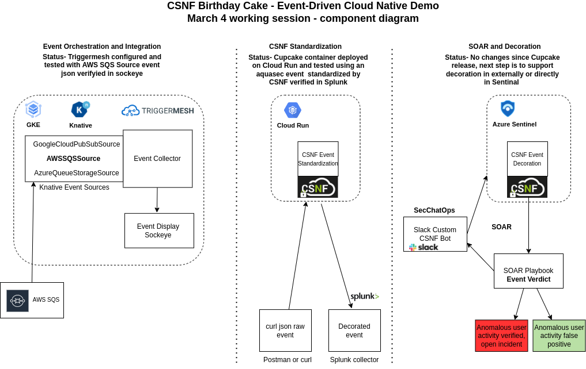

# Working Session notes

There are three main components that must come together for the Spring demo, also known as "birthday cake".

### Event Orchestration and Integration

Event Orchestration and Integration will be done using Triggermesh. We should discuss what a MVP with Triggermesh looks like in the context of "birthday cake".

### CSNF Standardization

The CSNF Standardization demo (a.k.a "cupcake") was delivered in Fall of 2021. The CSNF code from cupcake is now deployed from a docker image and running on Google Cloud Run. 

### SOAR and CSNF Decoration

SOAR and CSNF Decoration are new features in the scope of "birthday cake". We are planning to decorate the standardized event based on external data but have not yet defined MVP for "birthday cake".

### Diagram of "birthday cake" for Spring 2022

The components of "birthday cake" will need to be connected end-to-end so we need to agree on what the simplest way will be to accomplish that.

