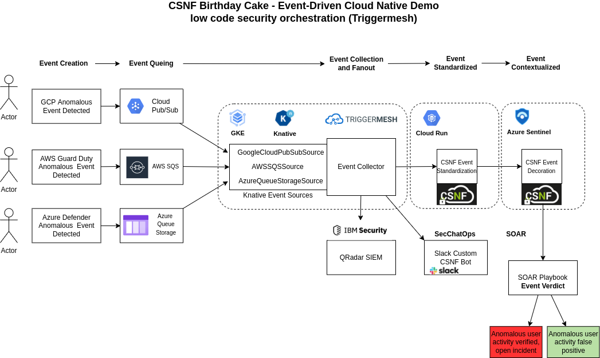

**The CSNF demo-service runs on Docker**

# Changes

To see what's changed in the current version, see [CHANGES.md](https://github.com/onug/CSNF/blob/main/birthday-cake/CHANGES.md)

# Demo Overview - Spring 2022 

The CSNF Spring 2022 demo extends the prior release of the CSNF by including an end-to-end anomalous user activity SOC scenario. 

## Implementation details

1. The original demo-service is containerized and will be deployed on Google Cloud Run. 

   - The demo service dictionary will need to be updated to support the anomalous user activity use case

2. An event-driven architecture (EDA) based on the Triggermesh Cloud Native Integration platform will be used to integrate the CSNF decorator. 

   - Triggermesh  requires a Kubernetes cluster and Knative as an installation dependency. 
   - Triggermesh API's are implemented as Kubernetes CRD's. The CRD's are used to bind Triggermesh objects to allow event transformations or implement custom event flow logic.  

   

   

   