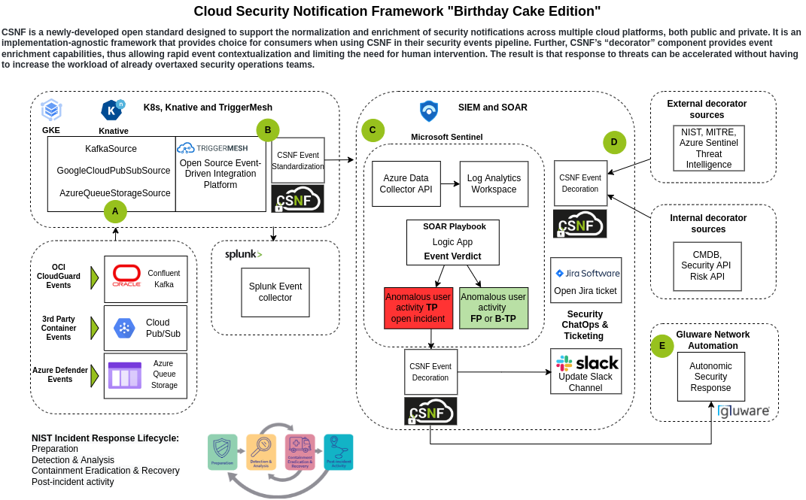

## Todo's for Birthday cake

**A to B**

**Cupcake to bday dictionary/standardization, Oracle works today + Microsoft (stretch goal) - Jeff/Josh**

- [ x ] Consume JSON Oracle Anomalous User event from Confluent Kafka topic (Jeff/Josh)
- [ x ] Consume JSON Azure Anomalous User event from Azure Queue Storage (Jeff/Josh)
- [ x ] Consume JSON Aquasec events from Google Pub Sub (Jeff)
- [ x ] Standardize Oracle event using birthday-cake > send to Sentinel (Jeff/Josh)
- [ x ] Standardize Azure event using birthday-cake > send to Sentinel (Jeff/Josh)
- [ x ] Standardize Aquasec event using birthday-cake > send to Sentinel (Jeff)
- [ x ] Determine Splunk HEC to use for the demo (Jeff/Peter)
- [ x ] Send Raw Oracle event to Splunk - need a Splunk (do not decorate)(Jeff/Josh)
- [ x ] Send Raw Azure event to Splunk (do not decorate)(Jeff/Josh)
- [ x ] Send Aquasec events into Splunk (Decorated) (Jeff)
- [ x ] Bumblebee / CSNF integration planning (Jeff/Josh/Peter)

**C to D**

**External decorator sources for CSNF - based on Customer Risk API; Internal decorator sources for CSNF - Azure Threat Intelligence**

- [ ] Configure and test internal decorator source - using the Risk API and integrate to playbook (Peter)
- [ ] Determine external decorator source - do this in Sentnel using Azure Threat Intelligence and/or MITRE (Preeti/Peter)
- [ ] Update playbook > Jira > Slack integration as required for Azure and OCI events (Peter/Preeti)
- [ ] Configure a Glueware org and basic auth credentials to access the GluAPI from Sentinel (Michael)
- [ ] Update the Sentinel Playbook to send the Sentinel CSNF decorated event to Gluware's HTTPS endpoint (Michael/Peter/Preeti)
- [ ] Update Jira and Slack Channel

**D to E**

**Gluware to publish custom API calls specific to CSNF events that would enable us to trigger a workflow vs specific actions like drift/audit/provision.(Michael)**

- [ ] Consume the Sentinel event in Glueware and audit the network configuration (Michael)
- [ ] Contain and preserve evidence for subsequent forensic investigation (Michael)
- [ ] Simultaneosly deploy a new network VPC based on last known good network state (Michael)
- [ ] Update Jira and Slack Channel

**E to F**

**Actions are remaining on Gluware team. If this is not complete to demo, we can include the available/expected actions in a slide**

- [ ] Perform an audit action action based on a value being passed within the Microsoft Sentinel Playbook event JSON.

**A through F**

**End to end testing of CSNF birthday cake scenario**

- [ ] Create mock event containing all the required values that will trigger anticipated Sentinel Playbook workflows required to exercise all demo use cases
- [ ] Determine presentation flow and supporting graphics, visuals that can be used to emphazise CSNF talking points
- [ ] Updated info graphic based on 'The Image' for the demonstration

## Birthday Cake Flow

